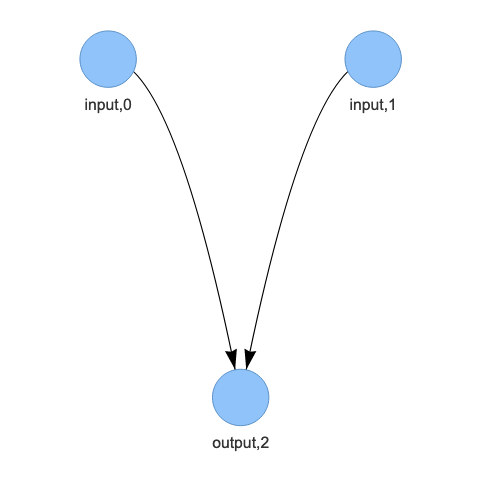
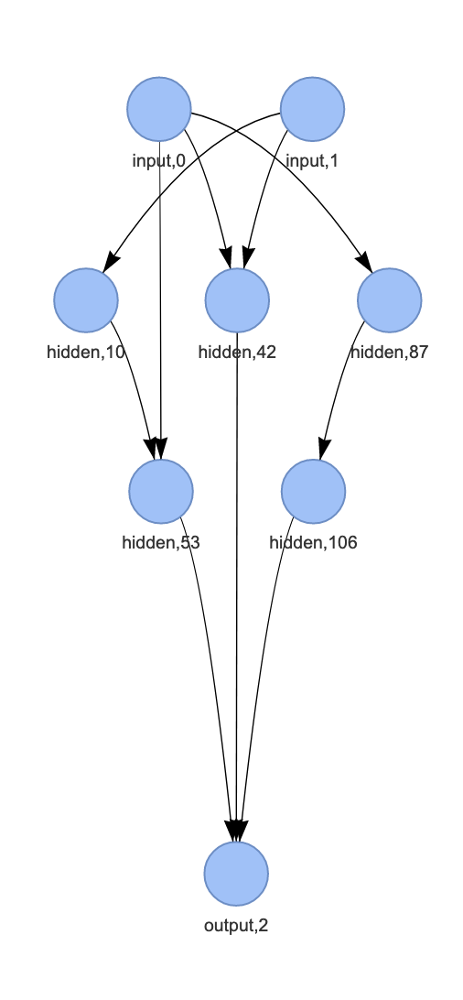

# Nano Neat

Nano Neat is a project focused on implementing NeuroEvolution of Augmenting Topologies (NEAT) for various environments using the Gymnasium library. The project includes experiments on different environments such as Bipedal Walker, CartPole, and Acrobot.

The NeuroEvolution of Augmenting Topologies (NEAT) algorithm is an evolutionary algorithm designed to evolve artificial neural networks (ANNs) over generations. Unlike traditional fixed-topology approaches, NEAT starts with simple networks and gradually complexifies their structure through mutations, speciation, and crossover, allowing for adaptive growth and innovation. More broadly, neuroevolutionary algorithms leverage evolutionary computation techniques, such as genetic algorithms, to optimize neural networks for tasks where gradient-based learning may be ineffective, making them particularly useful for reinforcement learning and control problems.

| Starting Topology | Evolved XOR-Solving Topology |
|------------------|----------------------------|
|  |  |

## Project Structure

- /experiments/old_approaches: Contains older versions of the Bipedal Walker experiments.
- /experiments/old_approaches/Bipedal_v2_wrk.py: Bipedal Walker experiment version 2.
- /experiments/old_approaches/Bipedal_v1.py: Bipedal Walker experiment version 1.
- /experiments/old_approaches/Bipedal_mate_with_other_experiment.py: Bipedal Walker experiment with mating from another experiment.
- /cart.py: CartPole experiment.
- /cart_results.py: Script to analyze results of CartPole experiments.
- /acrobot.py: Acrobot experiment.
- /acrobot_results.py: Script to analyze results of Acrobot experiments.
- /example.html: Example HTML file.
- /dbg.html: Debug HTML file.

## Model Structure

The model is composed of several key classes:

- Config: Holds configuration parameters for the NEAT algorithm.
- Node: Represents a node in the neural network.
- Connection: Represents a connection between nodes in the neural network.
- Genome: Represents an individual in the population, including its neural network structure.
- Population: Manages the population of genomes and handles the evolution process.
- Specie: Represents a species in the population, used for speciation.

## How to Run

1. Ensure you have the required dependencies installed. You can install them using pip:
   ```
   pip install torch networkx gymnasium pyvis dill
   ```

2. Run the desired experiment script. For example, to run the CartPole experiment:
   ```
   python cart.py
   ```

3. To analyze the results of an experiment, run the corresponding results script. For example, to analyze CartPole results:
   ```
   python cart_results.py
   ```

## Configuration

Each experiment script contains a configuration section where you can adjust parameters such as population size, mutation rates, and fitness thresholds.

## Results

The results of each experiment are saved in the /tmp directory under a subdirectory named after the experiment. Each subdirectory contains the saved models and statistics of the experiment.

## Contact

For any questions or issues, please contact the project maintainer.